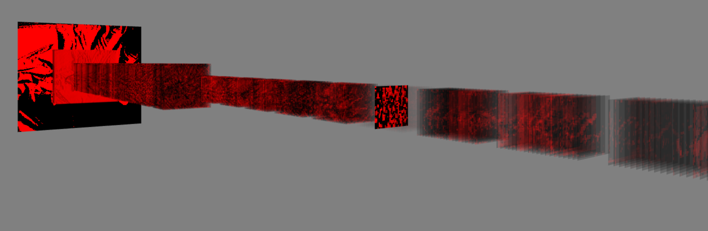

# Interactive Neural Network Visualization

This project aims to interactively visualize the low-level internals of neural networks. Currently, it's able to visualize the activations of ResNet50.

In order to render tensors directly from the GPU, this WebGL, TensorFlow.JS, and Three.JS.